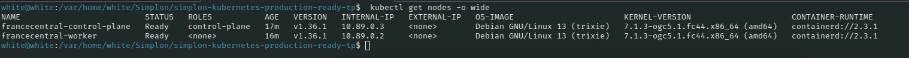
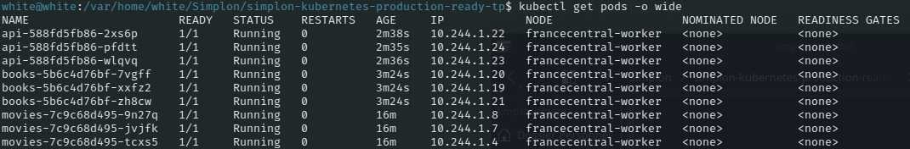
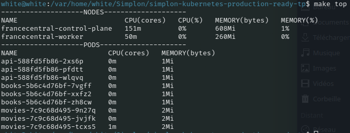
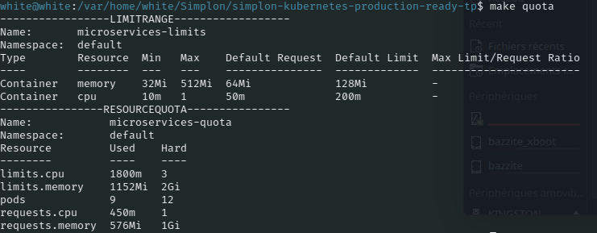
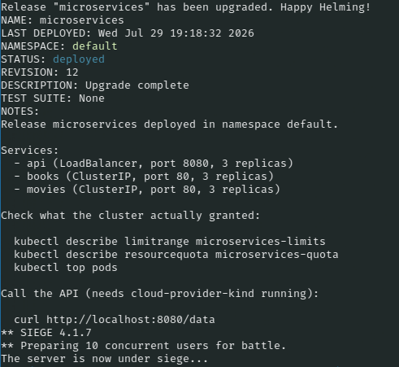
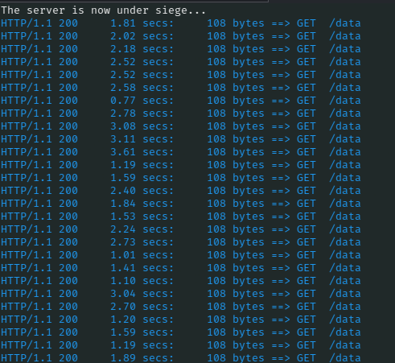
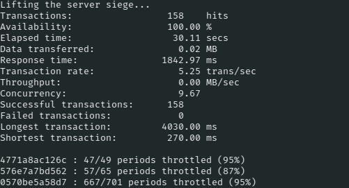

#  Production Ready: CPU & memory management on Kubernetes 


Three Go microservices (API Gateway, Books, Movies) already deployed and replicated on a Kind cluster. This iteration adds resource governance: `requests` and `limits` on every container, then a `LimitRange` and a `ResourceQuota` to keep the namespace under control.

> Brief: [docs/CONSIGNES.md](docs/CONSIGNES.md)

## Why

Right now the pods have no resource boundaries. A memory leak in one service can eat the whole node, and a busy loop can starve every other container sharing the same CPU. The goal here is to make that impossible, and to understand the two knobs that do it:

- **Requests**: what the scheduler reserves for the container. It is a guarantee, and it is what placement decisions are based on.
- **Limits**: the ceiling. Above it, CPU gets throttled (the container slows down) while memory gets the container OOMKilled (it dies).

CPU is compressible, memory is not. That asymmetry is the reason the two behave so differently when the limit is reached, and it drives how the values are picked.

## Architecture

```
              HOST  (http://localhost:8080/data)
                          │
                          ▼  LoadBalancer (cloud-provider-kind)
                          │
              Kind cluster (1 control-plane + 1 worker)
                          │
              ┌───────────┼───────────┐
              │           │           │
             api        books       movies
        (LoadBalancer) (ClusterIP) (ClusterIP)
```

One Docker image, three binaries, the container `command` picks the app. The API reaches the others by Service DNS name, injected as `BOOKS_API_HOST=books` and `MOVIES_API_HOST=movies`.

| App | Endpoint | Exposure |
|---|---|---|
| api | `GET /data` | LoadBalancer, aggregates the two others |
| books | `GET /books` | ClusterIP |
| movies | `GET /movies` | ClusterIP |

## Requirements

Docker, [kind](https://kind.sigs.k8s.io/), kubectl, and cloud-provider-kind for LoadBalancer support:

```bash
go install sigs.k8s.io/cloud-provider-kind@latest
```

## Setup

```bash
docker build -t microservices:1.0 .
make create-cluster          # cluster + image load
make deployments services
sudo cloud-provider-kind     # keep running in its own terminal
```

Kind ships without a metrics-server, and nothing resource related can be observed without it:

```bash
kubectl apply -f https://github.com/kubernetes-sigs/metrics-server/releases/download/v0.9.0/components.yaml

kubectl patch -n kube-system deployment metrics-server --type=json \
  -p '[{"op":"add","path":"/spec/template/spec/containers/0/args/-","value":"--kubelet-insecure-tls"}]'
```

The `--kubelet-insecure-tls` patch is needed because Kind's kubelets serve self-signed certificates that the metrics-server refuses by default.

Check it answers, then call the API:

```bash
kubectl top nodes
kubectl top pods
curl http://localhost:8080/data
```

```json
{"app":"API Gateway","data":{"books":["Book 1","Book 2","Book 3"],"movies":["Movie 1","Movie 2","Movie 3"]}}
```

Cleanup: `make delete-cluster`.

> **WSL2**: cloud-provider-kind may put the LoadBalancer IP on `lo`, and `localhost:8080` then hangs. Fix with `sudo ip addr del <EXTERNAL-IP>/32 dev lo`, re-run if it comes back.

## Results

### 1. Cluster with a single worker

```bash
kubectl get nodes -o wide
```



One control-plane and one worker, both `Ready`. The cluster was cut down to a single
worker on purpose: with only one node, all the pods land on the same machine, so the
resource pressure (and the effect of the limits) is actually visible instead of being
diluted across many nodes.

### 2. The 9 pods, all placed on the worker

```bash
kubectl get pods -o wide
```



The three services run 3 replicas each (`api`, `books`, `movies`), all scheduled on
`francecentral-worker`. Each replica is an independent container with its own
`requests` and `limits`: a limit applies per container, never to the group.

### 3. Real consumption (metrics-server)

```bash
make top
```



The metrics-server is what makes `kubectl top` work (kind does not ship it). The
services barely use anything: ~0-1m CPU and 1-2Mi RAM at rest. That gap between the
real usage and the configured `requests` (50m / 64Mi) is the whole point of measuring
before choosing values, rather than guessing large numbers "to be safe".

### 4. LimitRange and ResourceQuota in force

```bash
make quota
```



- **LimitRange** injects a default `request`/`limit` into any container that declares
  none, and rejects containers asking outside the `min`/`max` bounds.
- **ResourceQuota** caps the whole namespace. The `Used` vs `Hard` columns match the
  math exactly: 9 containers give `requests 450m / 576Mi`, `limits 1800m / 1152Mi`,
  `9` pods, all under budget.

### 5. Throttling experiment (API capped at 1m CPU)

```bash
make throttle          # cap the API Gateway at 1m CPU
make siege TIME=30S    # load test through a port-forward
make throttle-proof    # read the CFS throttling counters on the node
```



The API is redeployed with a `1m` CPU limit (1 millicore = 1/1000 of a core), then
put under siege with 10 concurrent users.



Every request still returns `HTTP 200`, but each one takes **1 to 3 seconds** instead
of a few milliseconds. The container is not dead, it is being slowed down: the kernel
grants it CPU time only in tiny slices and makes it wait for the next scheduling
period.



The numbers tell the full story:

| Metric | Value | Meaning |
|---|---|---|
| Response time | 1842 ms | ~500x slower than the unthrottled ~3 ms |
| Longest transaction | 4030 ms | one request waited ~40 CPU periods |
| Transaction rate | 5.25/s | throughput crushed by throttling |
| Availability | 100% | zero failed request |
| Throttled periods | 87-95% | 9 CPU cycles out of 10 blocked by the kernel |

**The lesson**: high latency **and** 100% availability together prove that a CPU limit
*throttles* (a brake) but never *kills*. CPU is compressible. Had this been a memory
limit being exceeded, we would see `Failed transactions` and pods in
`CrashLoopBackOff` instead, because memory is not compressible and the only way to
reclaim it is to OOMKill the container.

Back to normal with `make normal`.

### 6. ResourceQuota rejecting new pods

Scaling a deployment past the namespace ceiling (`pods: 12`) is refused at admission:

```bash
helm upgrade --install microservices ./chart --reset-values --set services.books.replicaCount=10
kubectl describe rs -l app=books | grep -i "exceeded quota"
```

```
Error creating: pods "books-..." is forbidden: exceeded quota: microservices-quota,
requested: pods=1, used: pods=12, limited: pods=12
```

`books` stays stuck (e.g. `3/10`), the extra pods are never created. This is the
rationing counterpart of throttling: the quota does not kill anything, it prevents the
creation in the first place.

## Progress

| Step | Status |
|---|---|
| Cluster rebuilt with a single worker node | done |
| metrics-server installed and patched | done |
| requests & limits on the 3 Deployments | done |
| Throttling experiment (CPU limit at `1m`) | done |
| LimitRange (defaults + min/max per namespace) | done |
| ResourceQuota (namespace ceiling) | done |
| Tests after the quota, rejected pods observed | done |

## Environment notes (Bazzite / podman)

This machine runs Bazzite (immutable Fedora), so the tooling lives in Homebrew and the
container engine is **rootless podman**, not Docker. Two consequences for the commands
in this README:

- Every `kind` command needs `export KIND_EXPERIMENTAL_PROVIDER=podman`.
- `kind load docker-image` is broken with podman here; the image is loaded through an
  archive instead (`podman save` + `kind load image-archive`).
- The `api` LoadBalancer stays `EXTERNAL-IP <pending>` (no cloud-provider-kind), so
  load tests go through `kubectl port-forward` via `make siege` rather than
  `localhost:8080`.
